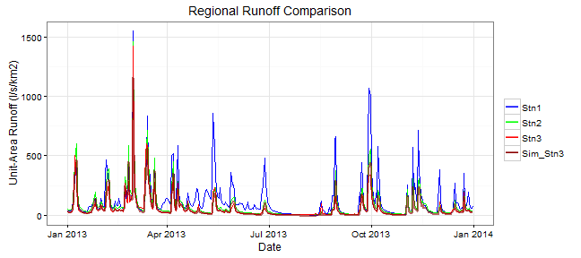

## Introduction

Time series data is collected extensively in many fields, including [hydrology](https://en.wikipedia.org/wiki/Hydrology).  
Typically flow in a stream or river will be monitored for a relatively short period of time (1-5 years), but it is required to estimate a long term flow series for the site in order to predict peak flows, flood hazards or the potential for hydro power generation.  
A long term flow series is usually produced by comparing the short term record from the site of interest to other nearby stations with a long term record. Multiple linear regression is a common technique to develop a relationship between stations and produce a long term simulated series for a station of interest.  
Another use for this technique is to fill in periods of missing data due to instrumentation failure or other reasons.

---

## An Example Data Set

An example data set is provided consisting of 1 year of flow data from 3 stations. The stations are in the same region (within 100 km) and so subject to the same general weather systems and are expected to have similar flow series. The flow data is scaled to the size of its watershed [(drainage basin)](https://en.wikipedia.org/wiki/Drainage_basin) for for more comparable plotting.  
One station, "Stn3", is missing data for the month of November and we wish to fill in the missing data with an estimated series based on a linear model using a prior period of data from one or both of the other two stations.  
Here is a plot of the example data set using both Stn1 and Stn2 as predictors (ggplot2):  


---

## Interactive LM

The Shiny App provides the user the ability to select a date range for training the model and a selector to choose one or both of "Stn1" and "Stn2" as predictors. The date range is limited to be a period prior to Nov and at least 7 days in length.  
The full time series of all 3 stations, as well as the simulated series for Stn3, are plotted and the adjusted r-squared of the model fit is displayed.  
A second plot of just the Nov and Dec data is also displayed for more detail. The Dec data is used for validation/testing and the RMSE between the simulated and actual Stn3 data is given.  
The plots and outputs are updated each time a new date range for training or alternate station selection is made.  
Outputs from example data in previous slide:  

```r
paste0(100 * round(summary(fit)$adj.r.squared, 2), "%")
## [1] "90%"
round(sqrt(sum((dat[month(dat$Date) == 12, "Sim_Stn3"] - dat[month(dat$Date) == 
    12, "Stn3"])^2)/31), 1)
## [1] 15.3
```

---

## Going Further

This Shiny App is a demonstration and uses an example data set. A more useful version would allow the user to upload their own flow data series and then select regional stations to use as predictors.  

If possible, regional stations could be linked to and downloadable. USGS and WSC provide long term data sets for stream flow monitoring stations in the U.S. and Canada respectively.

A map interface would also be useful for locating nearby stations once the user inputs coordinates for their station.

